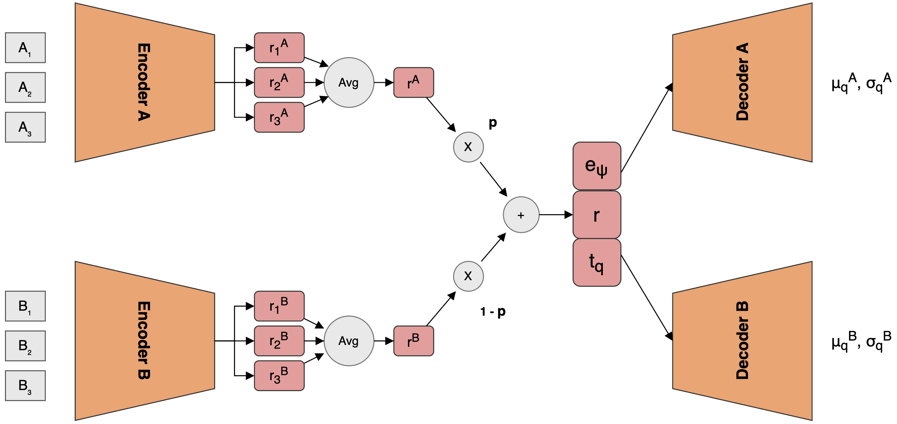
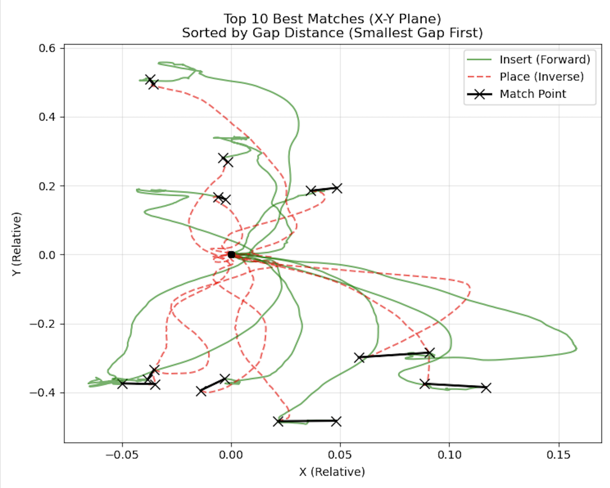
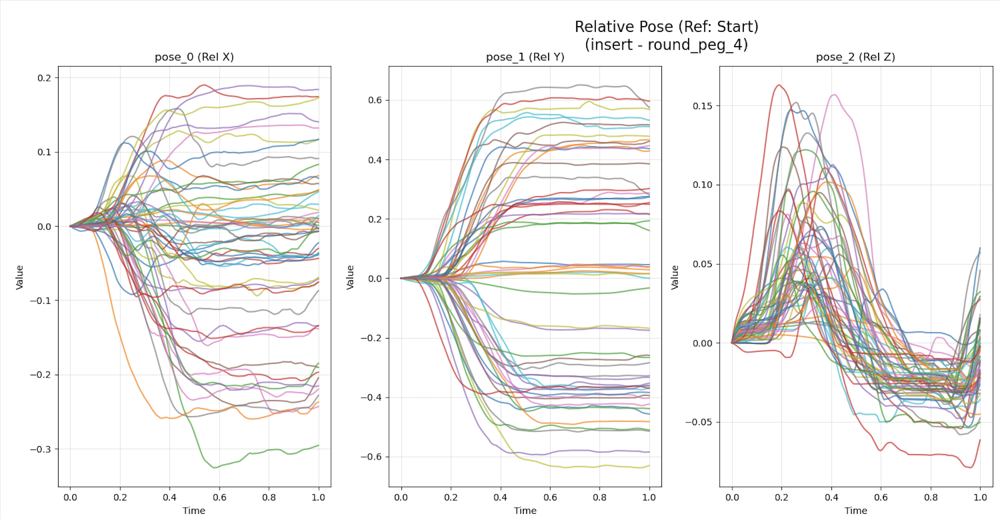
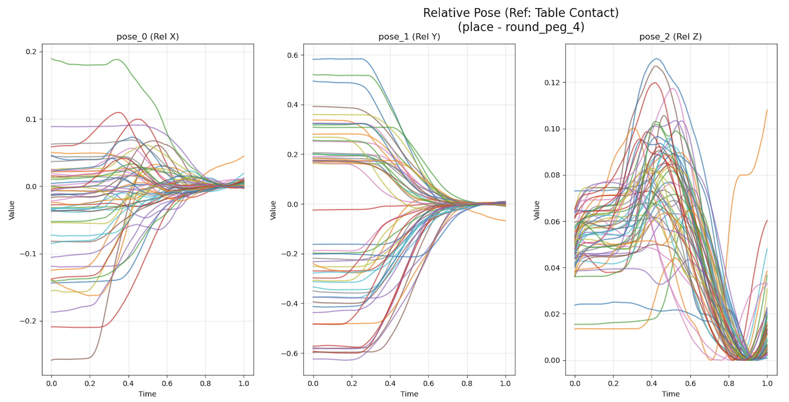
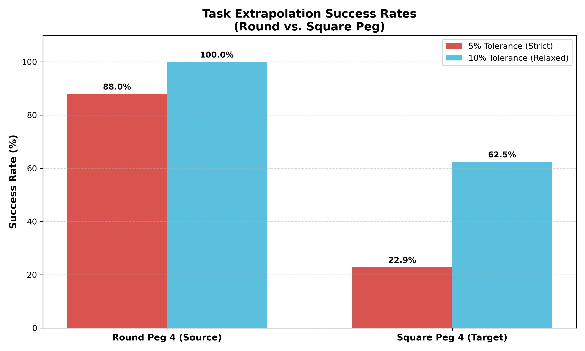

# Task Parameter Extrapolation for Robotic Assembly (Dual-CNMP)

[](https://pytorch.org/)
[](https://www.python.org/)
[](LICENSE)


## Project Overview

This repository contains the PyTorch implementation of a **Dual-Conditional Neural Movement Primitive (Dual-CNMP)** framework applied to the **REASSEMBLE dataset**.

The goal of this project is to solve the **Task Inversion** problem:
1.  **Train** a robot to perform both `Insert` and `Place` tasks for a known object (Round Peg).
2.  **Extrapolate** the `Place` skill to a **novel object** (Square Peg) for which the robot has *only* seen the `Insert` demonstration.
3.  **Achieve Zero-Shot Generalization** where the model generates a valid "return-to-origin" trajectory without ever training on the inverse task for the target object.

Key contributions include a custom **end-to-end data pipeline** for multimodal sensor synchronization and a **geometric relativization strategy** to enforce closed-loop spatial consistency.

---

## Architecture & Methodology

### 1. The Dual-CNMP Model
We utilize a Dual-Encoder architecture that maps sensorimotor trajectories into a shared latent space.
* **Encoder A (Forward):** Encodes the `Insert` trajectory.
* **Encoder B (Inverse):** Encodes the `Place` trajectory.
* **Shared Latent Space:** By forcing manifold alignment between these tasks, the model learns the semantic relationship between "Insert" and "Place" independent of the object identity.



### 2. Data Pipeline & Processing
* **Dataset:** [REASSEMBLE Dataset](https://tuwien-asl.github.io/REASSEMBLE_page/) (Multimodal: Pose, Joints, Force).
* **Trajectory Pairing:** Implemented the **Hungarian Algorithm** to minimize Euclidean distance between mismatched `Insert` end-points and `Place` start-points, creating valid semantic pairs from asynchronous data.



* **Geometric Relativization:**
    * *Insert:* Relativized to the trajectory start point ($t=0$).
    * *Place:* Relativized to the socket position (detected via Z-minima).





---

## Results

We evaluated the model using a **Rigorous Geometric Success Criterion** based on a Dual-Point Constraint. A generated trajectory is considered successful only if it satisfies **both** conditions simultaneously:
1.  **Start Point Accuracy:** The trajectory must initiate from the correct socket location (verifying the model recognized the object context).
2.  **End Point Convergence:** The trajectory must converge to the table origin (verifying the model learned the "return-to-start" logic).

Both points must fall within a strict spatial threshold (10% of workspace bounds) for the trial to count as a success.

| Object (Task) | Condition | Success Rate (10% Tolerance) |
| :--- | :--- | :--- |
| **Round Peg** | Known (Paired) | **100.0%** |
| **Square Peg** | **Unseen (Zero-Shot)** | **62.5%** |

> **Key Finding:** The model successfully extrapolated the closed-loop task logic to the Square Peg. It generated a valid trajectory that correctly identified the **novel socket location** and returned the object to the origin, despite never seeing a "Place" demonstration for this specific geometry.



---

## Installation & Environment Setup

This project requires **two separate environments** due to dependency conflicts with the original REASSEMBLE dataset tools.

### 1. REASSEMBLE Environment (Only for high level data extraction)
- Use this environment for data extraction (i.e., "choose_high_level_action.py").
- Follow instructions from the REASSEMBLE repo to create "REASSEMBLE" conda environment.
- [https://github.com/TUWIEN-ASL/REASSEMBLE](https://github.com/TUWIEN-ASL/REASSEMBLE)

- **Note:** Once raw high level actions are extracted to .npy files (in "raw_high_level_actions" directory), you should switch back to the main "task-inversion" environment for all subsequent steps (pairing, training, etc.).

### 2. Main Environment (For Preprocessing, Training, Evaluation)
Use this environment for all other tasks including data preprocessing, model training, and evaluation.

```bash
git clone <repository-url>
cd task-inversion
conda env create -f environment.yml
conda activate task-inversion
```

### 3. Download Data
* Download the REASSEMBLE dataset and place h5 files in the `data/original_reassemble_data` directory.

---

## Usage

### Data Preprocessing

Extract desired action-object combinations

```bash
python preprocessing/choose_high_level_action.py
```

Process raw trajectory data and synchronize high-level actions (interpolation):

```bash
python preprocessing/process_high_level_action.py
```

Relativize trajectories and plot:

```bash
python preprocessing/plot_relative_values.py
```

Match and pair forward-inverse trajectories for task inversion:

```bash
python preprocessing/match_and_stack_trajectories.py
```

### Model Training
To train the Dual-CNMP model on the paired (Round Peg) and auxiliary (Square Peg) data:

```bash
python model/insert_place_square_round_peg/train.py
```

### Model Evaluation
To test the Zero-Shot Extrapolation capabilities on the Square Peg:

```bash
python model/insert_place_square_round_peg/evaluate_and_plot.py
```

## Project Structure

```
task-inversion/
├── assets/                         # Image assets for README
├── data/                           # Data directory
│   ├── original_reassemble_data/   # Raw H5 data files
│   ├── paired_trajectories/        # Matched trajectory pairs
│   ├── processed_high_level_actions/ # Preprocessed action data
│   ├── raw_high_level_actions/     # Raw action recordings
│   ├── warped_trajectories/        # Time-warped trajectories
│   └── plots/                      # Visualization outputs
├── model/                          # Neural network models
│   ├── dual_enc_dec_cnmp.py       # Main dual encoder-decoder model
│   ├── model_noisy_paired.py      # Noisy paired training model
│   ├── model_predict.py           # Inference utilities
│   ├── loss_utils.py              # Custom loss functions
│   ├── validate_model.py          # Model validation
│   ├── insert_place_square_round_peg/ # Peg insertion task model (task extrapolation)
│   ├── multiple_high_level_model/ # Multi-task model
│   └── single_high_level_model/   # Single task baseline
├── preprocessing/                  # Data preprocessing scripts
│   ├── process_high_level_action.py # Action data processing
│   ├── match_and_stack_trajectories.py # Trajectory pairing
│   ├── cluster_trajectories.py    # Trajectory clustering
│   ├── warp_matched_trajectories.py # Dynamic time warping
│   └── plot_*.py                  # Visualization scripts
├── simulation/                     # Simulation and evaluation
│   ├── traj_error_noisy_paired.py # Trajectory error analysis
│   └── object_error_noisy_paired.py # Object placement error
└── REASSEMBLE/                     # Data I/O utilities
    └── io.py
```


